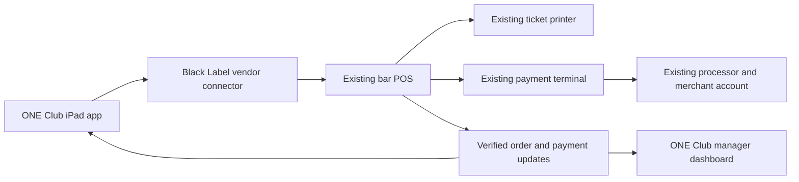

# ONE Club / Bar 45 — existing POS integration

Date: 2026-09-06. Status: proposed architecture; installed POS and merchant setup unidentified.

**Current scope:** Keep the existing processor/account and compatible hardware, while replacing the departing POS application. Follow [ONE-CLUB-EXISTING-PROCESSOR-CUTOVER.md](ONE-CLUB-EXISTING-PROCESSOR-CUTOVER.md). The design below that keeps the original POS vendor in the order/payment path is historical and does not meet the new independence requirement after that vendor is canceled.

## Decision

Build the ONE Club bar experience around the POS the bar already operates. Preserve its merchant account, settlement destination, payment terminals, printers, and staff checkout workflow wherever the vendor supports integration. Start by connecting menus and reporting, then enable order entry only after verifying the vendor can create and update the actual bar checks.

The intended product is a ONE Club iPad interface for bartenders, plus a manager dashboard. Black Label owns the application code and connector. The existing vendor continues supplying its licensed POS and payment services. Branding our application does not change ownership of the vendor's software or remove its fees.

## Current evidence

| Item | Verified status |
| --- | --- |
| Venue | ONE Club's official Bar 45 page describes cocktails, drafts, wine, happy hour, group events, and outdoor bar options. |
| Installed POS, version, reseller | Unknown. The user does not know its name. |
| Merchant account, processor, terminal model | Unknown for this venue. |
| Public vendor discovery | Inspected both restaurant websites in connected Chrome; neither inspected page identifies its POS or offers an ordering link identifying the provider. Local ONE Club proposal text also contains no POS vendor identification. |
| Existing prototype | ONE Club branding and an iPad-sized retail register with split tenders. The merchandise demonstration does not establish bar readiness. |
| Existing Square code | Historical ledger import for another tenant; not evidence that Bar 45 uses Square and not a live order-writing connector. |
| Existing Stripe work | Separate Stripe Terminal integration; it does not establish a connection to Bar 45's existing POS or merchant account. |

Sources inspected on 2026-09-06:

- https://oneclubgulfshores.com/bar45/
- https://bar45.com/
- Local `apps/api/src/import-square-ledger.ts`, `docs/POS-RUNBOOK.md`, `docs/one-club-theme/README.md`.
- ONE Club proposal folder: `/Users/michaelbarber/Blackwater/proposals/one-club/`.

## What becomes ours

| Surface | Intended implementation |
| --- | --- |
| Bartender iPad screen | ONE Club branding, large drink buttons, favorites, beer/wine/cocktail categories, modifiers, open-tab search, repeat round, seat/check split controls. Every action depends on the corresponding verified vendor capability. |
| Menu | Import vendor item, modifier, tax, and price identifiers. Retain the POS as the source of prices and availability. Apply happy-hour rules in one system. |
| Staff workflow | Map authenticated bartenders and managers to vendor staff IDs and permissions. Require manager authority and a reason for voids/comps. |
| Manager dashboard | Sales, tips, comps, open checks, and closeout exceptions from actual vendor records; explicitly show last sync and missing data. |
| Payment | Use the bar's existing approved POS/processor route. Final charge, tip, refund, receipt, and settlement remain tied to the original vendor transaction. |
| Hardware | Reuse supported devices after confirming model compatibility. An iPad browser does not automatically control an existing card reader, printer, or cash drawer. |

## Connection design

This diagram is the target when the vendor supports the required operations. API order creation alone does not prove existing open-tab edits, splitting, printer routing, or card-present payment control.

The POS remains authoritative for each check, tax total, payment, tip, refund, and closeout. Our database stores vendor IDs, command IDs, synchronization state, and display projections. It must not create a parallel independently collectible bill for the same drinks. Send each command once with a durable idempotency key; reconcile uncertain results before replaying. Confirm completion from authenticated vendor events or a vendor status read.

## Bar workflows to prove

1. **Open a tab:** create a named/table/seat check in the existing POS. If the venue uses card preauthorization, open and grow the authorization through the vendor's supported flow. A saved cart is not a preauthorized tab.
2. **Ring drinks:** import real menu items and valid modifiers such as spirit choice, single/double, mixer, and garnish; repeat a round without duplicating a previous send. Route the ticket once to the correct station.
3. **Split the check:** move selected drinks to another guest/check, divide a shared item where supported, or divide a balance evenly. Retain correct quantities, discounts, taxes, and rounding. The existing prototype's multiple-card payment support covers splitting a balance, not assigning drinks between guests.
4. **Pay:** support the venue's cash/card combinations and tip workflow. Record partial payments and remaining balance against the vendor check. Decline, cancellation, and lost connectivity must leave a recoverable check.
5. **Close:** verify capture and final tip, finalize the same vendor check, print the correct receipt, and reconcile to the bartender/drawer shift. Refund against the original tender. A spilled or comped drink must not be returned to bottle stock automatically.
6. **Continue service during outage:** follow the vendor's supported offline procedures and existing register workflow. Never silently queue an unknown card charge or display an unconfirmed payment as completed.

## Deployment sequence

1. **Identify and connect:** obtain a register login/About-screen photo or receipt, then confirm vendor/version, device models, account owner, and integration entitlement. Prefer that evidence before requesting credentials.
2. **Import without interrupting service:** connect the exact venue account with the minimum scopes required, import its real menu/staff/stations, and reconcile a historical shift against the existing closeout report.
3. **Pilot ONE Club order entry:** only if permitted APIs support the required checks and modifiers. Create a sandbox/test check, edit it from both systems, and verify ticket routing and synchronization before a supervised live pilot.
4. **Expand after payment proof:** enable our split/check controls only after the actual terminal, preauthorization, tip, refund, and closeout paths are proven with the same merchant account.

If the vendor only exposes reporting, deliver the branded manager/operations companion first and retain its native register for ordering and payment. If it supports orders but requires native checkout, use that supported checkout handoff. Choose a full custom bartender interface only when the required write and payment capabilities are demonstrated. Replacing the POS is a separate decision requiring the actual costs, contracts, migration work, and hardware compatibility.

## Acceptance example

Using vendor test mode and the venue's real menu configuration: open a tab, ring two rounds with modifiers, move one guest's drinks to a separate check, pay one check with cash plus card and a tip, pay the other on the existing reader, and close the shift. Compare both systems' checks, printed tickets, receipts, taxes, tips, and settlement records. Repeat with an interrupted response and confirm exactly one ticket and one payment per intended operation.

The next dependency is identifying the installed system. No ONE Club production POS connection or bar workflow acceptance is claimed by this document.
