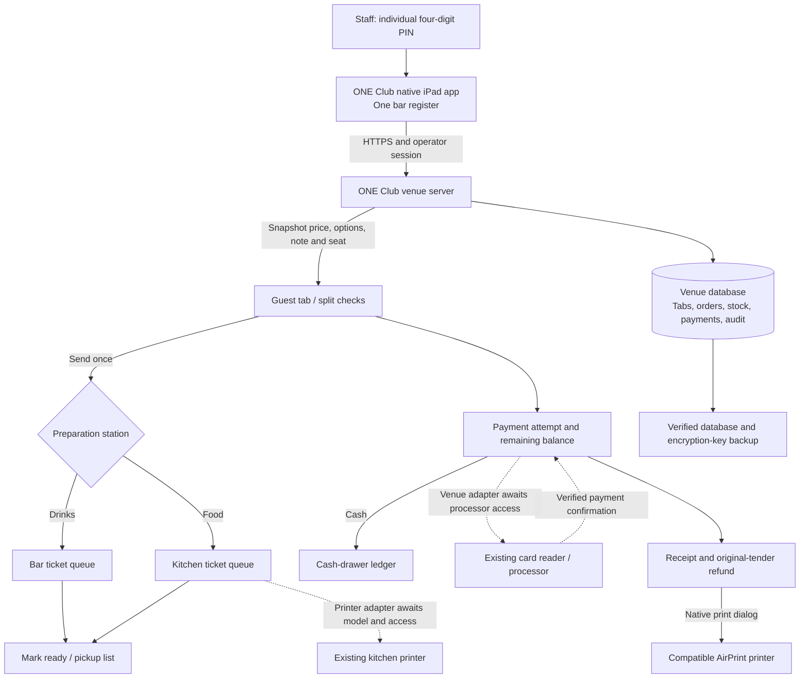

# ONE Club — complete connection map

**Onsite correction, September 6, 2026:** Michael identifies the payment hardware as **Ingenico**, the printer as **Star**, and confirms **there is no physical cash drawer**. Network discovery located Ingenico manufacturer-prefix interfaces at `10.1.10.167` and `10.1.10.248`; exact models, physical station assignments and processor remain unverified. The Star's model and connection type are unresolved. Physical drawer integration is not a venue requirement; cash-accounting software is a separate capability. Evidence: `/Users/michaelbarber/BlackLabel-Team/STATE/deliverables/one-club-network-intake-2026-09-06/README.md`.

**Menu/connection update, September 6, 13:05 UTC:** The iPad now uses `https://bar-one-pos.michael-070.workers.dev` and the persistent `.storage/bar-one-venue` database. Fifty photo-derived menu items and fifty bartender reference guides are loaded; fourteen prices are confirmed. Physical sign-in and menu/recipe viewing passed on build 5. The fixed-address relay recovered automatically in the controlled restart check. Hardware entries below retain their own evidence dates; none establish a completed payment or printed ticket. See [current menu/connection receipt](bar-one/menu-and-connection-2026-09-06.json).

Checked September 6, 2026. Scope: **one bar register, one iPad, four-digit staff PINs, food to the chef, drinks to the bar, reuse the venue’s equipment and processor where supported.**

The native iPad application is installed as **Bar One 1.0 (5)** on the connected iPad (A16), iPadOS 26.6.1. Physical sign-in and menu/guide viewing passed. It reaches the persistent venue server on this Mac through the fixed HTTPS address and authenticated outbound relay. The server owns orders, tabs, prices, stock and the payment ledger. The old POS application is not a runtime dependency.

Companion artifacts: [signed iPad installation receipt](ONE-CLUB-IPAD-INSTALL-2026-09-06.json), [54 source-linked routes and command inventory](ONE-CLUB-ROUTES.json), [earlier local acceptance receipt](ONE-CLUB-LOCAL-ACCEPTANCE.json), and [installation/server handoff](ONE-CLUB-IPAD-HANDOFF.md). The route inventory includes the remaining POS facade, session, callback and cash-session endpoints beyond the operating workflow below; a declared route does not establish an active external connection.

## System layout

Solid lines are implemented software paths. Dashed lines need the venue’s actual hardware/account connection. AirPrint code is compiled; physical printing has not been verified.

## Connector-by-connector audit

| Connection | Implementation and source | Verified state | Final device/account check |
|---|---|---|---|
| iPad app → register | SwiftUI + WKWebView, `apps/ipad/Sources/OneClubPOSApp.swift`; native connection screen, landscape/portrait, screen awake during service | Signed Release installed and launched on iPad (A16), iPadOS 26.6.1; physical four-digit sign-in passed | Broader venue workflow and hardware acceptance |
| App → venue server | Configured origin; HTTPS for deployed use; `venue-gateway.ts`, `bar-server.ts` | Physical iPad reaches persistent venue at fixed HTTPS origin; anonymous state 401 and bootstrap 403; valid staff session and relay restart recovery work | Always-on venue host and sleep/network-loss acceptance |
| Staff → session | `pos-auth.ts`, `js/auth.js`; exactly four digits, salted scrypt verifier, opaque cookie, incorrect-PIN lockout, role checks | PIN/auth tests; four-digit browser sign-in | Enter real staff names and set individual PINs |
| Register identity | `bar.js`: fixed `one-club-bar` register/drawer reference | One register in the application | Assign the physical bar iPad; no second register planned |
| Menu → price | `/api/pos/bar/menu`, server-owned price/modifier/happy-hour/tax snapshots | Price injection ignored; invalid choices rejected; stale edits rejected | Real food/drink menu, prices, tax and options |
| Menu → preparation station | Each item explicitly routes to `bar` or `kitchen` | Mixed food/drink order produces separate tickets; notes and sides follow the food | Confirm which items go to the chef and which the bartender makes |
| Menu import/export | CSV review then atomic add-only import; columns `name,category,price,station`; JSON recipe export | Duplicate names roll back the whole import; price parsing tested | Obtain menu export or enter menu manually |
| Recipe → stock | Base and option recipes; deduct once when the order is sent, not again at payment | Stock-once, shortage rollback and repeated-round tests | Enter starting bottle/ingredient counts and actual recipe quantities |
| Tab → split checks | Item split, equal split, seat movement, new check, merge, repeat order | Original tax preserved; equal totals differ by at most one cent; concurrent edit tests | Run their usual guest/seat scenarios on the iPad |
| Order → bar queue | `/tabs/:id/commands` with `action: send`, then `/state` | Only drinks on bar ticket | Decide whether bartender needs a printed slip |
| Order → chef queue | Same send creates a separate kitchen ticket with table, seat, modifiers and notes | Browser walkthrough: burger + side salad + “No onions” in kitchen; lager in bar | Connect kitchen printer or agree on how chef views the queue |
| Voids → kitchen changes | Voiding a sent item updates queued ticket items with VOID | Regression test verifies kitchen ticket change | Already printed/prepared tickets still require communicating the change to the chef |
| Chef → ready/pickup | `/tickets/:id/ready`, Ready for pickup list | Browser workflow tested | Chef’s physical display/print workflow needs acceptance |
| Ticket → printer | Ticket print view; browser print; native `oneClubPrint` bridge → `UIPrintInteractionController` | Ticket content rendered; native bridge compiles | Printer brand/model/interface, AirPrint support or vendor SDK, paper width and routing |
| Automatic kitchen printing | Queue data and print content exist; no vendor-specific printer transport is active | **Awaiting hardware**; queued does not mean physically printed | Implement the exact printer’s supported transport, test acknowledgment, outage and duplicate handling |
| Card check → payment attempt | `/api/pos/orders/:id/card-payments`; immutable order, amount, reader and idempotency key | Signed simulated partial-card + cash workflow tested | Existing merchant/provider API access and approved reader provisioning |
| Payment adapter → processor | `CheckoutProvider` in `packages/orders/src/providers.ts`; Stripe Terminal adapter already exists | Existing adapter is tested; practice script uses in-process simulated responses | Identify their provider. Reuse that account if independently integrable; build its specific adapter |
| Processor → payment confirmation | `/api/orders/webhooks/:provider`; signature, amount, order/attempt and replay checks | Signed callbacks tested; configured callback works in network-session mode | Register actual webhook and complete a real test charge with venue access |
| Card → remaining balance | One card portion at a time, then another card or final cash remainder | Browser payment status advances automatically after simulated confirmation | Physical reader latency, decline, cancel and disconnect tests |
| Open tab → card hold | Open tabs currently store the guest’s order; they do not hold funds on a card | **Not enabled** | Provider support for preauthorization, incremental authorization and completion |
| Tip → payment | Tip is set before checkout and included in the captured amount | Exact-cent calculation and UI percentages tested | Their tip policy; post-payment tip changes need processor support |
| Cash → drawer ledger | Open float, sale amount, cash handed over, change, paid-in/out/drop, count and close | Ledger tests; late drawer attachment supported; expected cash uses ledger calculation | Actual opening float and shift procedures |
| Ledger → physical drawer | No drawer-open command is sent | **Not applicable: Michael confirms no physical cash drawer** | No hardware integration required |
| Payment → receipt | Tenant-branded receipt, receipt number, lines, tax, tip, tender amounts and cash change | Receipt values verified against payment | Real receipt details and physical print test |
| Refund → original payment | Monetary adjustment for prepared food/drinks; same original tender; no automatic restock | Cash and simulated-card refund tests, replay checks; stock stays consumed | Real provider refund and settlement confirmation |
| Financial events → reconciliation | Existing `wiring.ts`, `pos-reconciliation.ts`, finance ledger and Money view | Existing root acceptance suite covers repair, drawer and ledger postconditions | Match a real payment/refund and end-of-day batch against processor settlement |
| Native export → file/share | `oneClubExport` bridge opens the iPad share sheet for CSV/JSON | Native build compiles | Save an actual export in Files on the venue iPad |
| Server → durable storage | File-backed SQLite; private storage directory; one venue; startup lock | Standalone server setup survived restart without re-provisioning the PIN | Select the always-on server host |
| Storage → backup | `scripts/backup-one-club.ts`: consistent DB snapshot, key copy, hash receipt, integrity check and critical counts | Created and read-verified a backup of the isolated acceptance DB | Set production backup destination/cadence and perform a restore drill before cutover |
| Old vendor → new system | Export/import, device release and merchant integration; no live dependency on old POS UI | Migration plan prepared | Export their real data, inspect ownership/admin access, reconcile open tabs/gift balances before removal |

## Exact request map

All paths below use the signed-in operator’s venue. The public venue gateway supplies the tenant; client `x-tenant-id` and `x-user-id` do not establish authority.

| Action | Route | Important facts |
|---|---|---|
| List staff / sign in | `GET /api/pos/auth/operators`, `POST /api/pos/auth/session` | `userId`, four-digit `pin`; cookie returned |
| Session / sign out | `GET/DELETE /api/pos/auth/session` | Current operator and revocable session |
| Staff access | `POST /api/pos/auth/operators`, `PUT /api/pos/auth/operators/:userId/pin` | Role-authorized staff creation/PIN changes; public bootstrap disabled on the venue server |
| Settings / readiness | `GET/PUT /api/pos/settings`, `GET /api/pos/readiness`, `GET /api/pos/processor` | Tax/location/receipt configuration, tender gates and provider verification |
| Read register | `GET /api/pos/bar/state` | Current menu, ingredients, open tabs, queued tickets and recent history |
| Save venue/equipment | `GET/POST /api/pos/bar/setup` | `expectedVersion`, device kind/model/connection/access; recording access is not verifying connection |
| Add/edit menu item | `POST /api/pos/bar/menu` | Integer cents, `prepStation`, choices, recipes; edits require expected version |
| Count stock | `POST /api/pos/bar/stock` | Integer units/ml, reason, expected version |
| Review/import CSV | `POST /api/pos/bar/menu-import-preview`, `/menu-import` | Review result first; all-or-nothing add-only import |
| Open tab | `POST /api/pos/bar/tabs` | Guest/tab name and table |
| Change/send tab | `POST /api/pos/bar/tabs/:tabId/commands` | Version + action; add uses menu ID, selected options, seat and preparation note |
| New/merged checks | `POST /tabs/:tabId/new-check`, `/tabs/:tabId/merge` under `/api/pos/bar` | Version checks; payment-started checks are locked |
| Start checkout | `POST /tabs/:tabId/checks/:checkId/checkout` | Version, fixed register ID, optional open cash session; returns one stable order ID |
| Attach later-opened drawer | `POST /tabs/:tabId/checks/:checkId/drawer` | Same register, open session, existing assignment preserved |
| Mark preparation ready | `POST /api/pos/bar/tickets/:ticketId/ready` | Durable ticket ID; no claim of printing |
| Charge a card portion | `POST /api/pos/orders/:orderId/card-payments` | Amount within remaining balance and durable payment key |
| Payment status | `GET /api/pos/orders/:orderId/balance`, `/payment-attempts` | Confirmation from server, never browser-declared success |
| Cancel/reverse payment | `POST /api/pos/payment-attempts/:attemptId/cancel`, `POST /api/pos/orders/:orderId/cancel-split` | Attempt cancellation or reversal of collected portions through original tenders |
| Final cash payment | `POST /api/pos/orders/:orderId/pay` | Remaining balance, cash received, durable tender key |
| Receipt/refund | `GET /api/pos/receipts/:orderId`, `POST /api/pos/orders/:orderId/refunds` | Original tender, amount, reason, refund key; current drawer required for cash refund |
| Open/adjust/close shift | `/api/pos/drawer/open`, `/drawer/:id/movements`, `/drawer/:id/close` | Fixed register, float, cash movements, counted close and variance |

Bar mutations require `Idempotency-Key`. Pending requests retain their key and initiating operator for recovery. The bar does not queue financial actions for blind offline replay. API reads do not fall back to stale financial data from the service worker.

## Physical wiring worksheet

| Segment | Connection to establish | Record before connecting | Acceptance evidence |
|---|---|---|---|
| Mac → iPad installation | Data-capable cable matching the actual iPad port; trust this Mac | iPad model, OS, UDID, management restrictions, Developer Mode, signing profile expiry | Correct bundle installed and launched on that iPad |
| iPad → venue network | Staff Wi-Fi with access to the server | SSID, DHCP/reserved address as applicable, DNS, client isolation, network administrator | Authenticated register works after sleep/wake and reconnect |
| Server → iPad | HTTPS reverse proxy → loopback port 8480 | Always-on host, DNS name, TLS certificate, service account, power/network recovery | Real iPad can load the configured origin; service restarts with saved tabs |
| Server/SDK → reader | Exact provider's approved network/Bluetooth/USB path | Make/model, serial, firmware, provisioning owner, merchant/location IDs, SDK/API and webhook access | Real approved charge, decline, disconnect recovery and original-card refund |
| Server/iPad → kitchen printer | Exact printer's supported LAN/vendor SDK or manual native AirPrint | Make/model, serial, IP/interface, paper width, protocol, station assignment | Food ticket physically emerges once with table, seat, modifiers and notes; paper-out/retry tested |
| iPad → receipt printer | Native print dialog or selected printer adapter | Same details, separate receipt role even if shared hardware | Physical guest receipt matches stored tender, tax, tip and change |
| Receipt printer/adapter → drawer | Not applicable | Michael confirms no physical cash drawer | No drawer purchase, wiring or opening test required |
| Server → backup destination | Scheduled encrypted/off-device storage access | Destination, credentials, retention, schedule, owner and restore location | Restore into a separate directory; matching key, counts, PIN access, tab and receipt |

The persistent venue server listens on loopback port 8480. The installed iPad uses the fixed Workers address above; all three task-owned temporary tunnels and the temporary LAN bridge were retired. Keep the Mac, venue service, relay and internet connection running. The fixed address does not make the database independent of this Mac. See `deploy/one-club/README.md` for service and recovery details.

With one bar iPad, a kitchen ticket queue alone does not deliver food instructions to a chef in another room. The recommended physical handoff is their kitchen printer; an existing kitchen display is an alternative if one is available. Automatic print acknowledgment/retry remains part of the exact printer adapter work.

## Verified local acceptance

- Signed native Release installed and launched on the actual iPad; saved HTTPS origin verified. See the dated installation receipt for exact build and physical test evidence.
- Root verification: 229 test files / 1,602 tests, plus TypeScript build checking. See the handoff for the final recorded result.
- Real Chrome walkthrough: four-digit sign-in; mixed kitchen/bar round; equal checks; $5 simulated card plus $10.60 cash with $9.40 change; $1 original-card refund; $13.20 second-check cash payment; tab closure.
- Closed drawer: opening $100.00, expected $123.80, counted $123.80, variance $0.00. The card refund correctly did not subtract drawer cash.
- Venue/equipment save and reopen, CSV price/station review/import, modifier ingredient save/reopen, and kitchen ready/pickup were exercised in the UI.
- Earlier browser viewport checks: 1180×820 landscape and 820×1180 portrait. Neither had horizontal content overflow; payment remained within the viewport. Physical WKWebView sign-in subsequently passed; that does not establish every orientation, keyboard, printing or performance scenario.
- Persistent-server acceptance: unauthenticated request 401, four-digit sign-in 201, same setup after restart; acceptance backup opened and integrity checked.

## Device inventory checked on this Mac

- Xcode 27.0 and iOS SDK are available; native device compilation succeeded.
- An Apple Development identity is available for team `745ZPGFRA5`.
- Connected iPad: iPad (A16), model iPad15,8, iPadOS 26.6.1; paired with Developer Mode enabled. The installer targeted only this iPad. Its development profile expires September 6, 2027, 12:11:48 UTC.
- No macOS print destination is configured. This does not identify or rule out printers at ONE Club.
- iPad installation and UI checks use Apple device tools and XCTest. Payment/printer connections use the POS adapters; no connector tool supplied the venue's merchant or printer configuration. Installed-app inspection did not identify their existing processor.
- Michael identifies Ingenico payment hardware and a Star printer. The actual processor, reader model, printer model and printer connection remain unverified. There is no physical cash drawer.

## Remaining venue cutover

1. Installation, pairing and Developer Mode are complete on the connected iPad. Confirm it is the final service device and choose its long-term signing/distribution method.
2. Replace temporary practice access with the permanent backend address. Confirm sign-in, sleep/wake, reconnect, portrait/landscape and saved tab recovery on the venue network.
3. Identify reader make/model, processor/merchant account, account administrator, and available SDK/API/provisioning path. Keep credentials server-side.
4. Identify the Star printer's exact model, interface, paper size and kitchen/receipt role. Set kitchen/bar routing before enabling automatic printing. No physical cash drawer is present.
5. Load the actual menu, modifier prices, food routing, tax, recipes, receipt footer and staff PINs.
6. Run one mixed food/drink order, modify it, send it once, verify the chef’s physical ticket, split it, charge/refund, verify the receipt and applicable cash accounting, restart/reconnect and close the shift.
7. Match processor settlement and verify backup restoration. Export/reconcile old-system data before removing its software and remote management.

The hardware/account steps are the remaining integration work. Purchasing or owning the reader alone does not establish its API compatibility, encryption-key provisioning or merchant portability.
