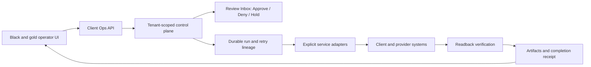

# Client Operations architecture

## Product boundary

`@blacklabel/client-ops` owns the sellable control plane: catalog, package manifest, installations, installed workflows, connectors, onboarding, runs, review items, artifacts, receipts, usage, and costs. Existing Black Label systems remain the execution foundations behind explicit adapters.

No client-ops table reaches directly into another module's table. Cross-module and external work passes through contracts or adapters, so each owner can evolve independently.

## Reuse map

| Product capability | Owned foundation | Client-ops use |
|---|---|---|
| Workflow OS | `BlackLabelPlatform/packages/workflows`, `actions`, `automation`, `reviews` | Durable execution, action cards, approvals, retries, evidence |
| AI Front Desk | `BlackLabelFrontDesk`; Platform `scheduling`, `customers`, `messaging` | Realtime voice shell, contact/schedule/summary adapters |
| Sales Operator | `BlackLabelLeadsAPI`; `ProjectUtah`; Platform `crm`, `outreach` | Provenance, quality gates, enrichment, pipeline and follow-up |
| Marketing Operator | `BlackLabelMarketing`; Platform `files`, `reviews`, `outreach` | Asset versions, exact approval, publishing adapters, briefs |
| Support Operator | `BlackLabelSupport`; Platform `messaging`, `files`, `actions` | Grounded response policy, tickets, evidence, escalation |
| Executive HQ | `BlackLabelHQ`; Platform `dashboard`, `actions`, `automation` | Read models, accountable action cards, verified briefs |
| Private Agent | `BlackLabelSovereign`; `sovereign-live`; `ProjectUtah` | Private knowledge/tool adapters, policy and audit boundary |
| Data Operations | `BlackLabelLeadsAPI`; `ProjectUtah`; `BlackLabelPropertyHarvest` | Import, normalize, dedupe, validate, lineage, export |

## Runtime model

Runs carry an idempotency key, root run ID, attempt number, and optional retry parent. A successful adapter must record its external reference and readback evidence before a completion receipt is produced. A potentially consequential action enters the review inbox whenever policy, confidence, or connector health requires it.

## Tenant and security rules

- Every mutable record is scoped by `tenant_id`; handlers obtain it from trusted tenant middleware.
- Installation access is always checked within the active tenant.
- Credential material stays behind the existing encrypted admin credential boundary; client-ops records store only connector state and safe configuration metadata.
- Artifacts are referenced by immutable URI and optional SHA-256; private contents remain in the file/storage boundary.
- Audit events record actor, decision, state change, and time.
- Package manifests are canonicalized and SHA-256 verified before installation.

## Clean-room reuse boundary

Reuse Black Label-owned source, interfaces, schemas, and operating patterns. Third-party or recovered application binaries, branding, bundled skill text, and proprietary catalogs are reference evidence only and are not redistributed. Compatible behavior is reimplemented inside the owned platform and adapters.
